<div align="center">

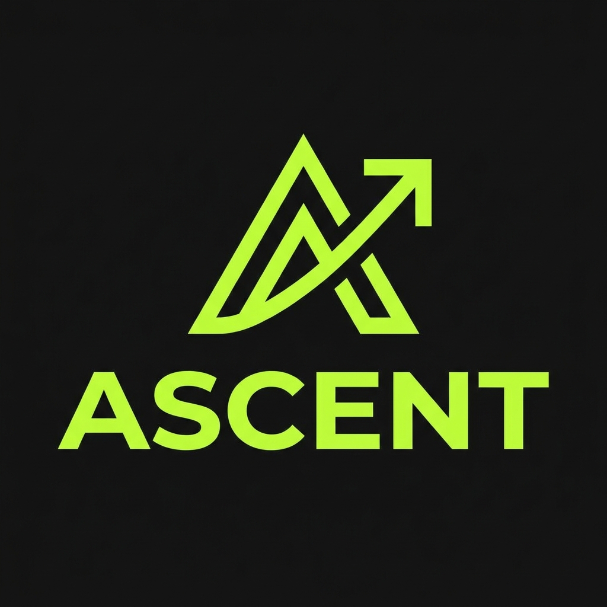

# ASCENT

### Entfessle dein Potenzial.

**Kraftsport-Tracker für Android & Web — datengetrieben, offline-fähig, ohne Ablenkung.**

<br />


<br />


</div>

---

## Über Ascent

**Ascent** ist ein privater, hochspezialisierter Kraftsport-Tracker für eine kleine Trainingsgruppe (Owner + 1–2 Partner). Kein Social-Feed, keine Ablenkung — nur Training, Zahlen und Fortschritt. Die App tracked jeden Satz live am Gerät, funktioniert **offline im Flugmodus** und synchronisiert nach dem Reconnect über alle Geräte hinweg. Das Browser-Dashboard verdichtet die Trainingsdaten zu Statistiken, verwaltet Pläne und liefert die Android-App per Direkt-Download aus.

Die Fortschrittsprognose ist **bewusst statistisch** (lineare Regression über den geschätzten 1RM nach Epley) — kein Blackbox-„KI"-Versprechen, sondern nachvollziehbare Mathematik, die dauerhaft kostenlos bleibt.

> **Ästhetik „Dark Performance":** tiefes Anthrazit, ein einziger aggressiver Lime-Green-Akzent für Aktion und Erfolg, Inter mit schweren Schnitten und tabellarischen Ziffern. Optimiert für die Bedienung mit Trainingshandschuhen und schwitzigen Fingern im Gym.

### Kernfunktionen (MVP / V1)

| | Feature | |
|---|---|---|
| 🔐 | **Auth & Multi-Device-Sync** | E-Mail/Passwort-Login, Trainingsdaten auf allen Geräten |
| 🏋️ | **Trainingspläne** | Pläne mit Übungen, Zielsätzen, Wiederholungsbereichen & Pausenzeiten |
| ⏱️ | **Aktives Training** | Satz-für-Satz-Logging (kg × Wdh.) mit Pausentimer, offline-fähig |
| 📚 | **Übungsdatenbank** | ~1'300 Übungen mit Ausführungs-GIFs, Suche & Muskelgruppen-Filter |
| 📈 | **Kraft-Prognose** | Statistische Trendlinie über den geschätzten 1RM (ab 3–5 Einheiten) |
| 📊 | **Browser-Dashboard** | Trainingsvolumen, Körpergewicht-Historie, persönliche Rekorde |
| 🎚️ | **Feature-Flags** | Jedes Feature per zentraler Entitlement-Konfiguration schaltbar (Freemium) |
| 📦 | **APK-Distribution** | Signierte APK per Sideloading + JSON-basierter Update-Check |

---

## Screens

Die vollständige UI wurde in **Google Stitch** entworfen und liegt als Design-Export unter [`design/`](design/) — je Screen ein Ordner mit `code.html` und `screen.png`, plus das komplette Design-System in [`design/ascent_design_system/DESIGN.md`](design/ascent_design_system/DESIGN.md).

### 📱 Android-App

<table>
  <tr>
    <td align="center" width="33%">
      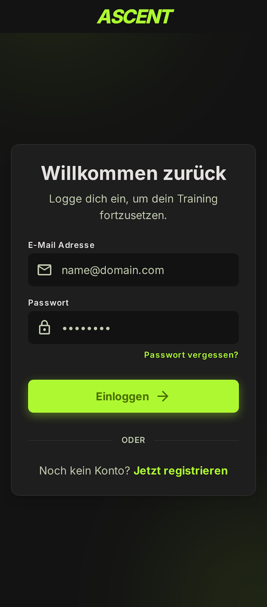<br />
      <sub><b>Login</b> — „Willkommen zurück"</sub>
    </td>
    <td align="center" width="33%">
      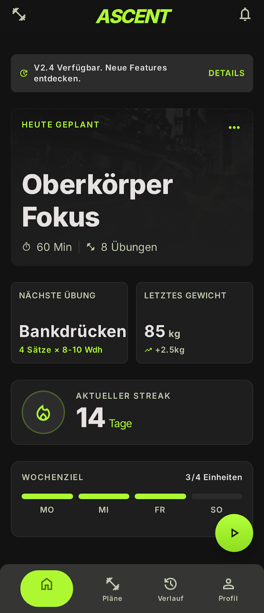<br />
      <sub><b>Home</b> — heutiger Plan, Streak, Wochenziel</sub>
    </td>
    <td align="center" width="33%">
      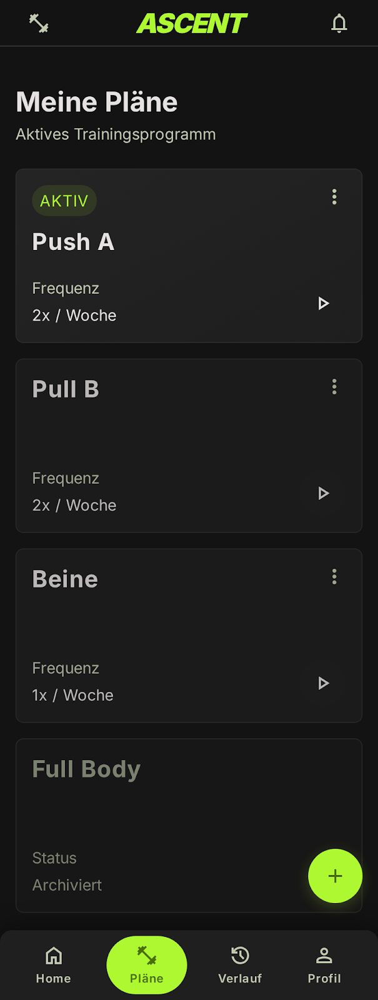<br />
      <sub><b>Meine Pläne</b> — aktiv / archiviert</sub>
    </td>
  </tr>
  <tr>
    <td align="center" width="33%">
      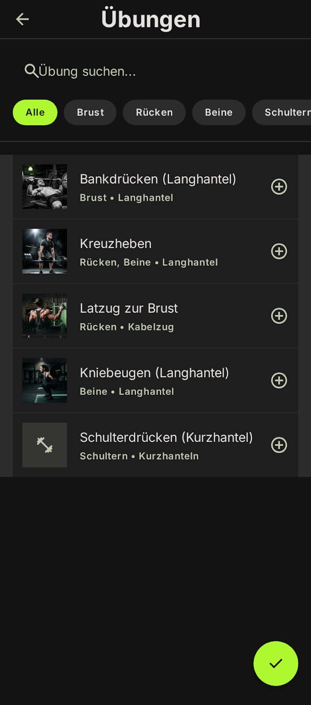<br />
      <sub><b>Übungsauswahl</b> — Suche & Filter-Chips</sub>
    </td>
    <td align="center" width="33%">
      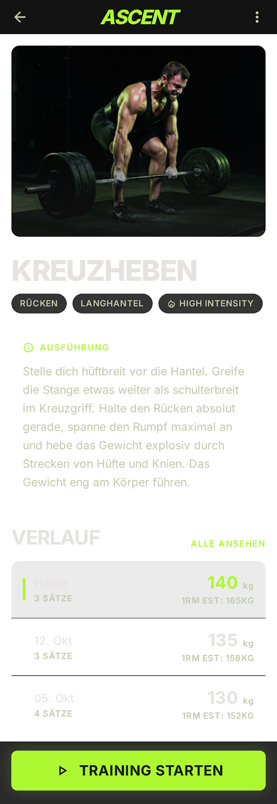<br />
      <sub><b>Übungsdetail</b> — Ausführung & 1RM-Verlauf</sub>
    </td>
    <td align="center" width="33%">
      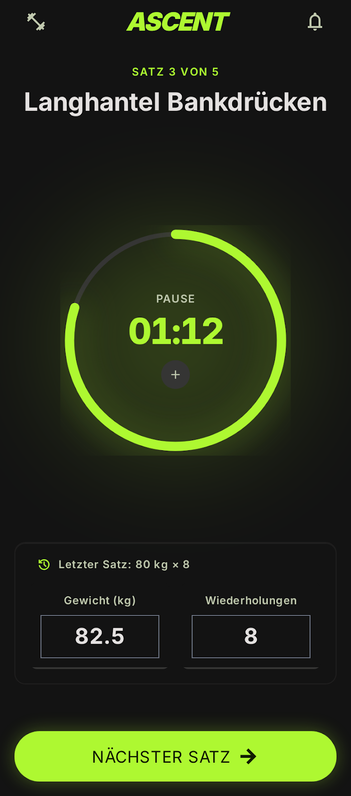<br />
      <sub><b>Aktives Training</b> — Satz-Logging & Pausentimer</sub>
    </td>
  </tr>
</table>

### 🖥️ Web-Dashboard

<table>
  <tr>
    <td align="center" width="50%">
      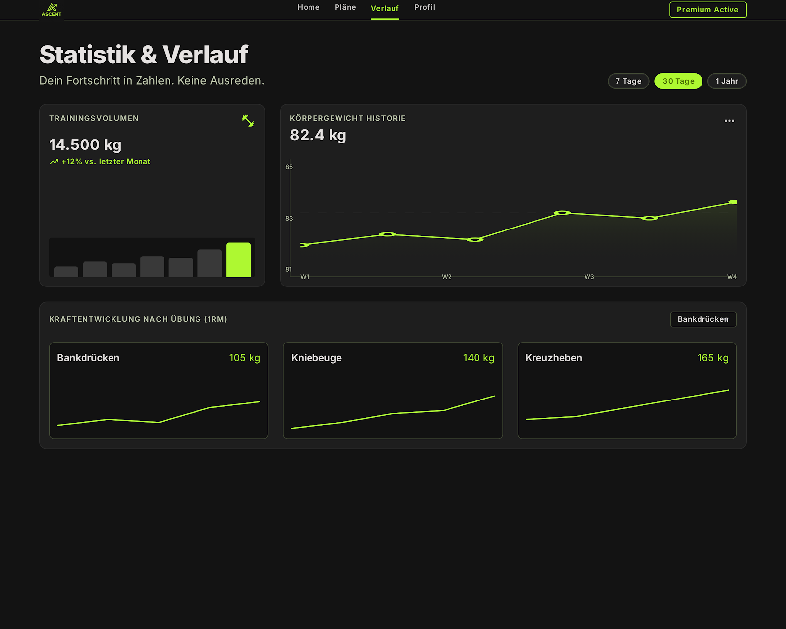<br />
      <sub><b>Statistik &amp; Verlauf</b> — Volumen, Körpergewicht, 1RM je Übung</sub>
    </td>
    <td align="center" width="50%">
      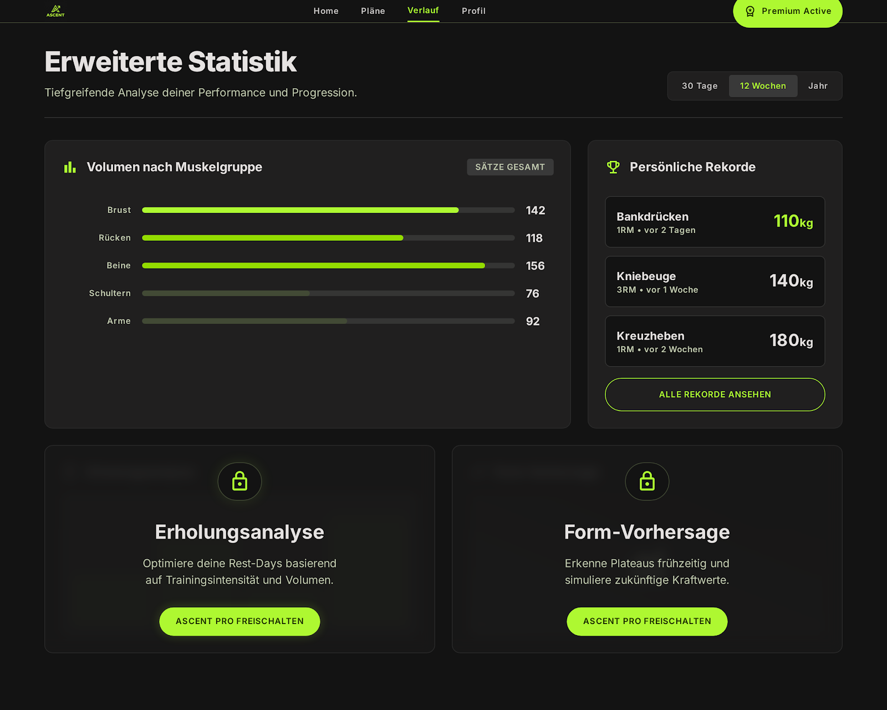<br />
      <sub><b>Erweiterte Statistik</b> — Volumen je Muskelgruppe, Rekorde (Pro)</sub>
    </td>
  </tr>
  <tr>
    <td align="center" width="50%">
      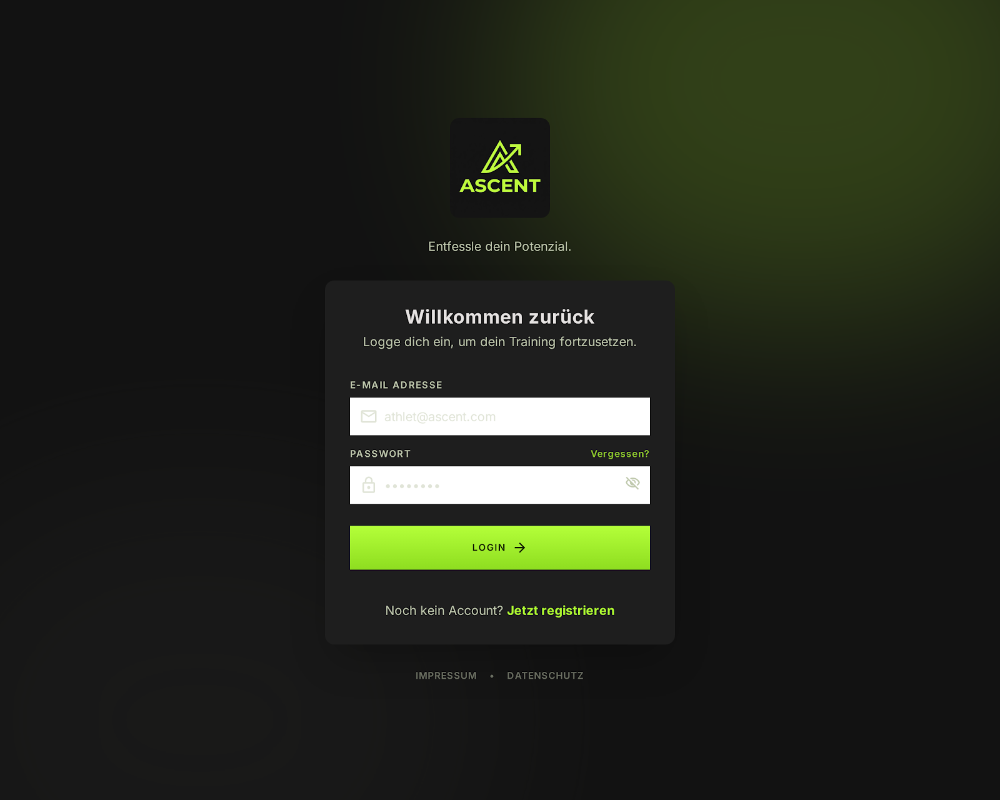<br />
      <sub><b>Web-Login</b></sub>
    </td>
    <td align="center" width="50%">
      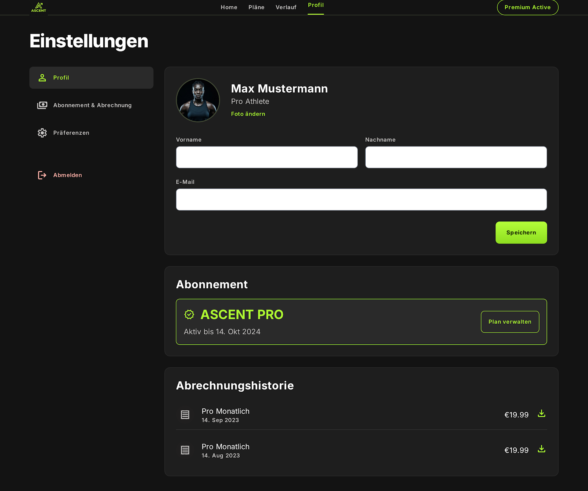<br />
      <sub><b>Einstellungen</b> — Profil, Abo &amp; Abrechnung</sub>
    </td>
  </tr>
</table>

---

## Design-System

Die Marke ist **leistungsorientiert, diszipliniert, utilitaristisch** — für Athleten, die Präzision und Fortschritt über Social-Schnickschnack stellen. Tiefe zwischen Ebenen entsteht durch **tonale Schichtung statt Schatten**.

### Farbpalette

| Swatch | Token | Hex | Verwendung |
|---|---|---|---|
|  | `background` | `#121212` | Basis-Hintergrund (Level 0) |
|  | `surface-container` | `#1E1E1E` | Karten / Module (Level 1) |
|  | `surface-high` | `#2C2C2C` | Modals, Ränder, Progress-Tracks (Level 2) |
|  | `primary-container` | `#B4FF39` | **Akzent** — CTAs, Progress, aktive States |
|  | `primary-fixed-dim` | `#93DB00` | Gradient-Endpunkt auf Primär-Buttons |
|  | `on-surface` | `#E5E2E1` | Primärer Text & kritische Daten |
|  | `outline` | `#8C947B` | Labels, Metadaten, Divider |
|  | `error` | `#FFB4AB` | Fehler / destruktive Aktionen |

> Der Lime-Green-Akzent ist **exklusiv** für Aktion und Erfolg reserviert — nie dekorativ. Er muss immer hohen Kontrast gegen den dunklen Hintergrund halten.

### Typografie & Layout

- **Schrift:** Inter — schwere Schnitte (700–800) für Headlines, **tabellarische Ziffern** für kg/Wdh./Timer, damit Zahlen in Listen exakt untereinander stehen.
- **Grid:** 4px-Baseline. Mobile = 4-Spalten-Fluid, 16px Margins. Desktop = 12 Spalten, max. 1200px, zentriert.
- **Radien:** 8px Standard (Karten/Buttons/Inputs), Pill-Form für Progress-Bars & Chips.
- **Touch-Targets:** min. 48×48dp — Gym-tauglich mit Handschuhen.
- **Dark Mode ist Pflicht**, nicht optional.

---

## Architektur

pnpm-Monorepo, TypeScript durchgängig. `.npmrc` setzt `node-linker=hoisted` (zwingend für Metro/React Native).

```
ascent/
├── packages/
│   └── shared/     Single Source of Truth: Drizzle-SQLite-Schema,
│                   Progression-Mathematik (Epley-1RM, Trendlinie), Zod-Validierung
│                   (source-only — Consumer bundeln src/ direkt, kein Build-Step)
├── apps/
│   ├── api/        Cloudflare Worker (Hono) · Bindings DB (D1) + MEDIA (R2)
│   ├── web/        Vite + React SPA · Tailwind v4 (CSS-first) · react-router v7
│   └── mobile/     Expo SDK 57 · NativeWind v4 (Tailwind 3.4.x) · Android
└── design/         Stitch-UI-Export + Design-System
```

### Tech-Stack

| Ebene | Technologie |
|---|---|
| **Sprache** | TypeScript (strict, `verbatimModuleSyntax` → `import type` erforderlich) |
| **Backend** | Cloudflare Workers + [Hono](https://hono.dev) · D1 (SQLite) · R2 (Media) |
| **Datenbank** | Drizzle ORM · Migrationen via drizzle-kit aus dem Shared-Schema |
| **Auth** | Better Auth — Invite-Code-Registrierung, Cookie- + Bearer-Sessions, DB-Rate-Limits |
| **Web** | Vite · React · Tailwind CSS v4 · react-router v7 |
| **Mobile** | Expo (SDK 57) · React Native · NativeWind v4 · Reanimated 4 |
| **Validierung** | Zod v4 (im Shared-Package) |
| **Monorepo** | pnpm 10 · GitHub Actions CI (Typecheck → Test → Web-Build) |

### Sync-Konventionen (Offline-First)

Synchronisierte Tabellen folgen einer festen Konvention, die die spätere Pull/Push-Synchronisation (M4) trägt:

- **Client-generierte UUID-Text-PKs** — kein Autoincrement, Konflikte bei Offline-Erfassung ausgeschlossen.
- **Epoch-ms-Integer-Timestamps** (`createdAt`, `updatedAt`) — keine server-generierten Zeiten.
- **`deleted`-Flag** für Soft-Deletes statt echter Löschung.

Das gilt für alle Sync-Tabellen (`exercises`, `plans`, `plan_exercises`, `workouts`, `workout_sets`, `body_metrics`). Ausnahmen: `users` (Better-Auth-Domäne) und `feature_flags` (reine Server-Konfiguration ohne Gerätesync).

### Datenmodell

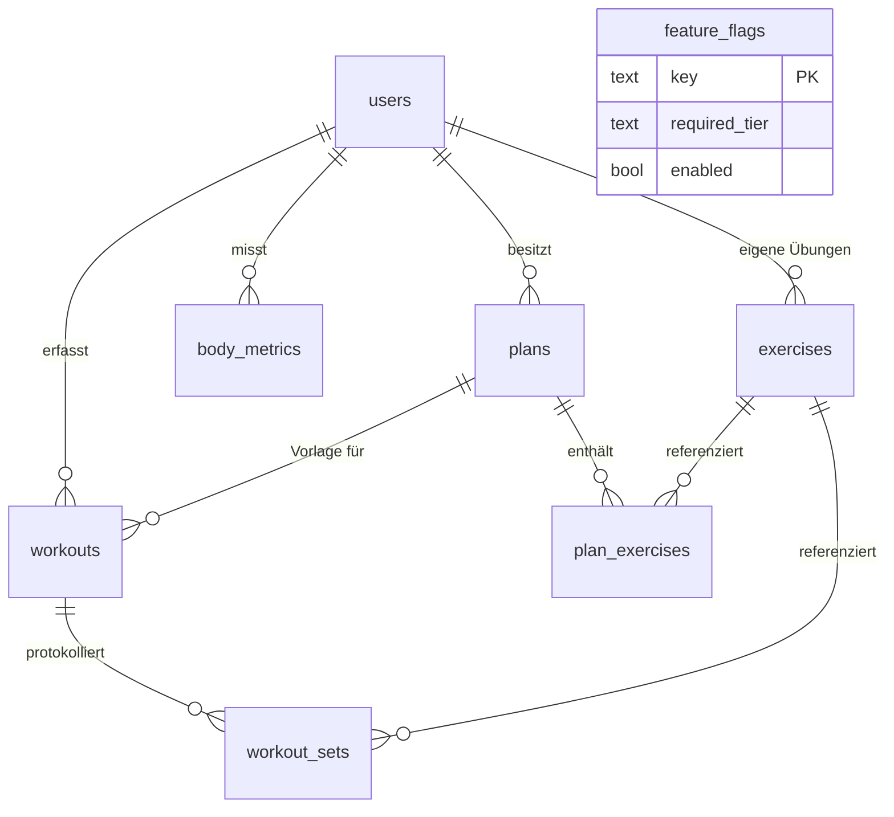

---

## Monetarisierung & Feature-Flags

Freemium-Architektur laut Lastenheft: **5 CHF/Monat**, **50 CHF/Jahr**, 14-tägige Testphase. Der entscheidende Grundsatz:

> **Kein Feature wird je hart im Code gated.** Jedes Feature ist zwischen Free- und Pro-Tier schaltbar — ausschliesslich über die zentrale `feature_flags`-Tabelle. Der `/entitlements`-Endpoint löst die Flags pro Tier (`free` · `trial` · `pro`) auf.

Die statistische Kraftprognose bleibt bewusst **im Free-Tier**. Alle echten KI-Features (personalisierte Pläne, Erholungsanalyse, Form-Vorhersage) sind Pro-exklusiv.

<div align="center">
  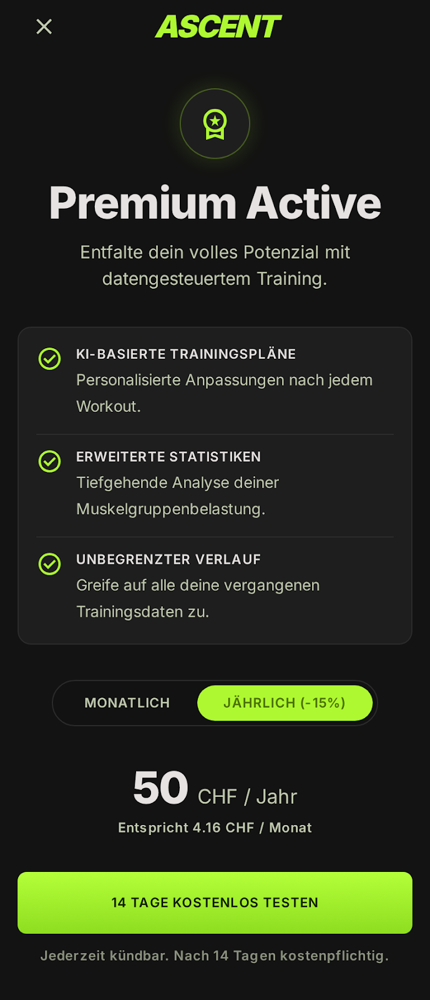
  <br /><sub><b>Premium Active</b> — Upgrade-Screen (Android)</sub>
</div>

---

## Loslegen

**Voraussetzungen:** Node ≥ 22, pnpm 10.

```sh
pnpm install                                  # einmalig
pnpm --filter @ascent/api db:migrate:local    # lokale D1-Migration anwenden
pnpm --filter @ascent/api db:seed:local       # Feature-Flags seeden
pnpm dev                                       # API (:8787) + Web (Vite) + Expo parallel
```

Einzeln starten:

```sh
pnpm --filter @ascent/api dev       # nur der Worker (127.0.0.1:8787)
pnpm --filter @ascent/web dev       # nur das Web-Dashboard
pnpm --filter @ascent/mobile dev    # nur die Expo-App
```

Qualität (läuft identisch als CI auf GitHub Actions):

```sh
pnpm typecheck                          # alle Pakete
pnpm test                               # alle Pakete (Vitest)
pnpm --filter @ascent/shared test       # einzelnes Paket
pnpm --filter @ascent/web build         # Production-Build
```

Nach Schema-Änderungen in `packages/shared` die Migration neu generieren:

```sh
pnpm --filter @ascent/api db:generate
```

> 💡 **`127.0.0.1`, nicht `localhost`:** wrangler dev bindet nur IPv4 — der Vite-Proxy zeigt deshalb auf `127.0.0.1:8787`. `localhost` löst hier zu `::1` und läuft in Timeouts.

---

## Cloudflare-Deployment

Die API läuft live unter **https://ascent-api.sweber.workers.dev**. D1-Datenbank (`ascent-db`, Region EEUR) und R2-Bucket (`ascent-media`) existieren; die `database_id` ist in [`apps/api/wrangler.jsonc`](apps/api/wrangler.jsonc) eingetragen. Lokale Entwicklung braucht keinen Cloudflare-Login — wrangler simuliert D1/R2 lokal.

```sh
pnpm --filter @ascent/api db:migrate:remote   # Migrationen auf Remote-D1
pnpm --filter @ascent/api db:seed:remote      # Feature-Flags auf Remote-D1
pnpm --filter @ascent/api run deploy          # Worker deployen
```

> ⚠️ **`run` nicht vergessen:** `pnpm --filter @ascent/api run deploy` — ohne `run` greift pnpms eingebauter `deploy`-Befehl statt unseres Scripts.

---

## Roadmap

| Etappe | Umfang | Ziel-Kriterium | Status |
|:---:|---|---|:---:|
| **M0** | **Fundament** — Monorepo, CI, Cloudflare-Setup (Worker, D1, R2), Drizzle-Schema | `pnpm dev` startet alle Apps, Deploy grün | ✅ |
| **M1** | **Backend-Kern** — Auth (Invite-Code-Registrierung/Login), CRUD Pläne/Workouts, Sync-Endpoints, Entitlements | API-Tests grün, Auth-Flow via REST durchspielbar | ✅¹ |
| **M2** | **Übungsdatenbank** — Import-Script, GIFs in R2, Übungs-API mit Suche/Filter | 1'300 Übungen inkl. GIF über API abrufbar | 🔨 |
| **M3** | **Android-Kern** — Login, Plan-Editor, Übungsauswahl, aktives Training, lokale SQLite | Komplettes Workout offline im Flugmodus erfassbar | ⏳ |
| **M4** | **Sync** — Pull/Push App ↔ Backend, Multi-Device-Test | Offline auf Gerät A erfasst → nach Reconnect im Web sichtbar | ⏳ |
| **M5** | **Web-Dashboard** — Charts, Trendlinie, Kalender/Verlauf, Planverwaltung, APK-Download | Alle MVP-Dashboard-Anforderungen im Browser nutzbar | ⏳ |
| **M6** | **Release** — Design-Polish, deutsche UI-Texte, APK-Signing, version.json-Update-Check, D1-Backup | Signierte APK installiert, Trainingspartner einladbar | ⏳ |

**Aktueller Stand:** M0 abgeschlossen und live verifiziert; M1 (Backend-Kern) implementiert und per API-Tests abgesichert. Der Zugriffsschutz ist umgesetzt — **Registrierung nur per Invite-Code** (Bootstrap-Ausnahme für den allerersten Nutzer), `requireAuth` schützt alle Datenrouten zentral, Rate-Limits liegen in der DB.

> ¹ **M1 fehlt noch der Produktiv-Rollout:** Remote-Migration, `BETTER_AUTH_SECRET` via `wrangler secret put` und Deploy. Details & offene Punkte siehe [`PROJEKTSTATUS.md`](PROJEKTSTATUS.md).

---

## Plattform-Scope

| ✅ Im Scope (V1) | ❌ Ausserhalb V1 |
|---|---|
| Android-App (offline + Sync) | iOS |
| Web-Dashboard (Login, Statistik, Verwaltung) | App Stores |
| Kraft-Tracking (Gewicht/Wdh.) | Öffentliche Registrierung |
| Statistische Trendlinie | Leaderboards / Social Feeds |
| APK per Sideloading | Live-Coaching, Plan-Marktplatz |
| Freemium via Feature-Flags | Ausdauer, Ernährung, Wearables |

---

## Konventionen

- **Sprache:** Dokumentation und UI sind **Deutsch** (Schweizer Konventionen: „ss" statt „ß", CHF-Preise). Deutsche Wörter sind lang (*Wiederholungen*, *Trainingseinheit*) — Container brauchen flexible Breiten.
- **Synchronisierte Tabellen:** niemals Autoincrement-IDs oder server-generierte Timestamps einführen (siehe Sync-Konventionen oben).
- **Feature-Gating:** ausschliesslich über `feature_flags` — nie über hartcodierte Bedingungen.
- **Tailwind:** Web = v4 (CSS-first via `@theme`, **kein** `tailwind.config.js`); Mobile = 3.4.x (NativeWind-v4-Zwang). Die Unterschiede sind Absicht.

---

## Dokumentation

| Dokument | Inhalt |
|---|---|
| [`PROJEKTSTATUS.md`](PROJEKTSTATUS.md) | **Einstiegspunkt** — aktueller Stand, Stolperfallen, offene Punkte |
| [`Lastenheft_Fitnessapp_Brainstorming.md`](Lastenheft_Fitnessapp_Brainstorming.md) | Anforderungen (Muss/Soll/Kann), Scope, Prioritäten |
| [`Technisches_Konzept_MVP.md`](Technisches_Konzept_MVP.md) | Stack-Begründung, Datenmodell, Sync-Design, Etappenplan M0–M6 |
| [`design/ascent_design_system/DESIGN.md`](design/ascent_design_system/DESIGN.md) | Vollständiges Design-System (Tokens, Typografie, Komponenten) |
| [`CLAUDE.md`](CLAUDE.md) | Arbeitskonventionen & Kommando-Referenz |

---

<div align="center">

> ⚖️ **Lizenz-Hinweis:** Die Übungsdatenbank (`hasaneyldrm/exercises-dataset`) ist **nicht-kommerziell** lizenziert — in Ordnung für den privaten MVP, muss aber vor Aktivierung des Abo-Modells durch eine kommerzielle Quelle oder eigene Medien ersetzt werden.

<br />

**Ascent** · Privates Projekt · Kein öffentlicher Vertrieb, keine App Stores.

<sub>Entfessle dein Potenzial. Keine Ausreden.</sub>

</div>
